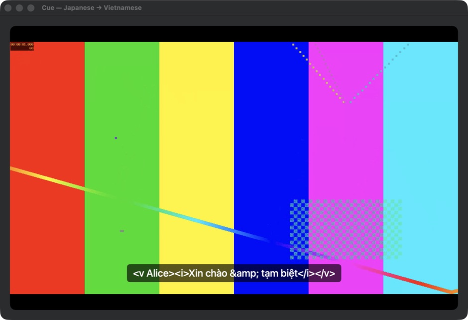
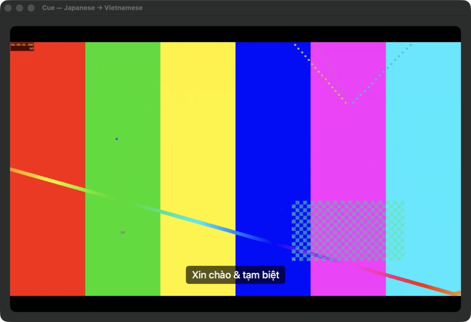

# 04 — Supported subtitle parsing and readable preview

Tab-separated VTT settings and identifiers such as NOTEBOOK no longer discard cues. A missing SRT separator no longer swallows the next cue. Imports with rejected blocks, repaired separators, unsupported settings, or metadata pause automatic source-file synchronization. The preview renders supported tags/entities as plain text; source/editor text retains its markup. Decoding is cached until cue text changes.

| Measurement | Before | After |
|---|---:|---:|
| Valid VTT cues retained in two regression fixtures | 0/2 | 2/2 |
| Adjacent SRT cues retained without blank separator | 1/2 | 2/2 |
| Lossy import can automatically rewrite the source | Yes | No |
| Markup/entity escapes visible in subtitle preview | Yes | No |
| 10k-cue SRT parse median | 97.39 ms | 121.55 ms |
| Full Swift suite | 464 passed | 469 passed |
| Python tests / compiler warnings | 8 / 0 | 8 / 0 |

Parser timing uses the same optimized harness, 917,787-byte fixture, and ten warm invocations. The parser is **24.16 ms slower** in this measurement; added validation is not a speed improvement. Moving file work off the main actor is a separate item. Before/after regression tests exercise the real parser, importer, and PlayerController; `./script/run_tests.sh` passes.

Screenshots show the actual PlayerPane embedded in a small native SwiftUI fixture app, with the same generated video, cue, window size, and paused position. They are not mockups or screenshots of the complete Cue workspace.

